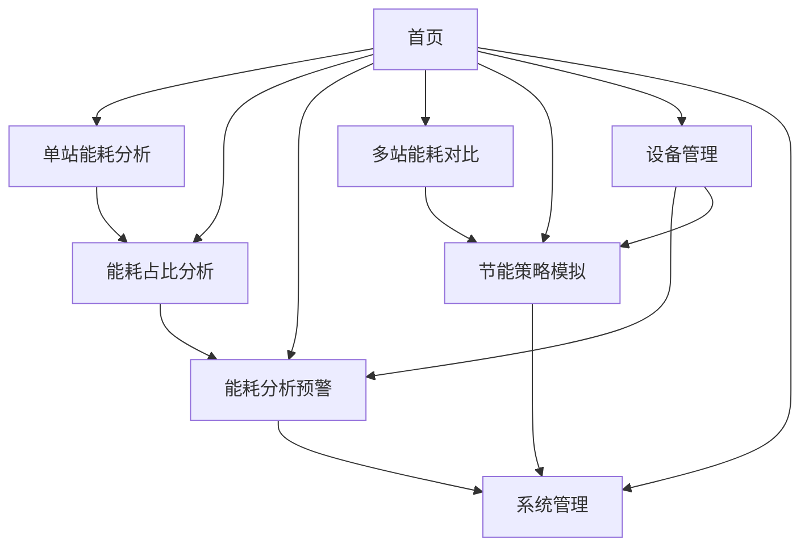

# 中国高铁站节能降耗演示系统 - 功能设计文档汇总索引

## 1. 系统概述

中国高铁站节能降耗演示系统是一个基于Vue 3+Element UI构建的现代化能耗管理平台，旨在帮助高铁站实现精细化能源管理，降低能源消耗，提高能源使用效率。系统通过数据采集、分析、可视化和预测等手段，为高铁站管理者提供科学决策支持。

系统核心功能涵盖：
- 多维度能耗数据分析和可视化
- 预警和异常检测
- 节能策略制定与模拟
- 设备全生命周期管理
- 系统管理和权限控制

## 2. 功能模块概览

| 序号 | 模块名称 | 主要功能 | 关联文档 |
|------|---------|---------|----------|
| 1 | 入口页 | 项目选择、站点地图展示、站点选择、系统入口 | [09-入口页功能设计文档/09-入口页功能设计文档.md](09-入口页功能设计文档/09-入口页功能设计文档.md) |
| 2 | 首页 | 系统概览、关键指标展示、快速导航 | [01-首页功能设计文档/01-首页功能设计文档.md](01-首页功能设计文档/01-首页功能设计文档.md) |
| 3 | 单站能耗分析 | 单站能耗数据查看、多维度分析、趋势分析 | [02-单站能耗分析功能设计文档/02-单站能耗分析功能设计文档.md](02-单站能耗分析功能设计文档/02-单站能耗分析功能设计文档.md) |
| 4 | 能耗占比分析 | 能耗占比分析、饼图可视化、多维度对比 | [03-能耗占比分析功能设计文档/03-能耗占比分析功能设计文档.md](03-能耗占比分析功能设计文档/03-能耗占比分析功能设计文档.md) |
| 5 | 能耗分析预警 | 预警规则配置、预警信息展示、预警处理 | [04-能耗分析预警功能设计文档/04-能耗分析预警功能设计文档.md](04-能耗分析预警功能设计文档/04-能耗分析预警功能设计文档.md) |
| 6 | 多站能耗对比 | 多站数据对比、横向分析、差异分析 | [05-多站能耗对比功能设计文档/05-多站能耗对比功能设计文档.md](05-多站能耗对比功能设计文档/05-多站能耗对比功能设计文档.md) |
| 7 | 节能策略模拟 | 策略模板、策略推荐、实时模拟、效果评估 | [06-节能策略模拟功能设计文档/06-节能策略模拟功能设计文档.md](06-节能策略模拟功能设计文档/06-节能策略模拟功能设计文档.md) |
| 8 | 设备管理 | 设备分类、维护记录、能耗预测、预警管理、报表生成 | [07-设备管理功能设计文档/07-设备管理功能设计文档.md](07-设备管理功能设计文档/07-设备管理功能设计文档.md) |
| 9 | 系统管理 | 用户管理、角色管理、权限矩阵、菜单管理、系统设置、操作日志 | [08-系统管理功能设计文档/08-系统管理功能设计文档.md](08-系统管理功能设计文档/08-系统管理功能设计文档.md) |

## 3. 各模块详细说明

### 3.1 入口页模块

入口页模块是用户登录成功后的第一个页面，提供项目选择和站点查看功能。主要包括：
- 多高铁项目选择器（京沪、京广、沪昆、哈大高铁）
- 项目概况统计（站点总数、正常运行、告警站点）
- 真实地图展示站点分布（基于Leaflet和OpenStreetMap）
- 站点列表查看和快速进入
- 站点详情弹窗展示

通过入口页，用户可以直观了解各高铁线路的站点分布和运行状态，快速选择站点进入监控系统。

### 3.2 首页模块

首页模块是系统的核心入口，提供系统整体概览和快速导航功能。主要包括：
- 系统导航菜单，展示系统主要功能模块
- 关键能耗指标概览，如总能耗、日能耗变化等
- 最近预警信息快速查看
- 系统运行状态监控

通过首页，用户可以快速了解系统整体运行状况和关键数据，为进一步分析提供入口。

### 3.3 单站能耗分析模块

单站能耗分析模块专注于单个高铁站的能耗数据分析，支持多维度分析：
- 基础数据查看：按日、周、月、年等不同时间维度查看能耗数据
- 趋势分析：通过折线图展示能耗变化趋势
- 对比分析：不同时间段的能耗对比
- 分类分析：按能源类型、设备类型等分类查看能耗数据

该模块帮助用户深入了解单个车站的能耗特点和变化规律，为节能策略制定提供数据支持。

### 3.4 能耗占比分析模块

能耗占比分析模块分析各维度下的能耗占比情况：
- 能源类型占比分析：电力、燃气等能源的使用占比
- 区域占比分析：不同区域（候车厅、站台、办公区等）的能耗占比
- 设备类型占比分析：不同设备类型的能耗占比
- 时间占比分析：不同时段的能耗占比

通过饼图和环形图等可视化方式，清晰展示能耗构成，帮助用户识别能耗重点和优化方向。

### 3.5 能耗分析预警模块

能耗分析预警模块负责监测能耗异常情况：
- 预警规则配置：用户可以自定义预警规则，如能耗阈值、变化率等
- 预警信息展示：以列表和图表形式展示预警信息
- 预警等级管理：支持不同预警等级（低、中、高、紧急）
- 预警处理：标记已处理、忽略或转工单处理预警信息

该模块帮助用户及时发现能耗异常，提高能源管理效率。

### 3.6 多站能耗对比模块

多站能耗对比模块提供多个高铁站之间的能耗对比分析：
- 站点选择：支持选择多个站点进行对比
- 指标对比：总能耗、单位面积能耗、人均能耗等指标对比
- 趋势对比：不同站点能耗趋势对比
- 差异分析：分析站点间的能耗差异及其原因

通过对比分析，帮助用户了解不同站点的能耗水平，识别最佳实践站点。

### 3.7 节能策略模拟模块

节能策略模拟模块提供节能策略制定和效果评估：
- 策略模板：预定义的常用节能策略模板
- 策略推荐：基于历史数据和机器学习算法的策略推荐
- 实时模拟：模拟策略实施后的能耗变化
- 效果评估：评估策略的节能效果和投资回报

该模块帮助用户科学制定节能策略，评估策略效果，降低决策风险。

### 3.8 设备管理模块

设备管理模块提供全面的设备生命周期管理：
- 系统管理：设备系统的基础信息管理
- 系统能耗分析：各设备系统的能耗分析
- 系统关联分析：分析不同系统间的能耗关联性
- 设备分类管理：设备分类的增删改查
- 维护记录管理：设备维护记录的记录和管理
- 能耗预测：基于AI算法的设备能耗预测
- 异常预警：设备运行异常的预警管理
- 报表生成：自动生成各类设备报表

该模块帮助用户全面管理设备，优化设备运行效率，降低维护成本。

### 3.9 系统管理模块

系统管理模块提供系统级的管理和配置功能：
- 系统概览：系统整体运行状态和统计信息
- 用户管理：用户账户的增删改查
- 角色管理：系统角色的定义和管理
- 权限矩阵：功能权限的精细化控制
- 菜单管理：系统菜单的动态配置
- 系统设置：系统参数的配置
- 操作日志：系统操作日志的查看和管理

该模块确保系统安全稳定运行，提供灵活的权限控制和管理功能。

## 4. 模块间关系图



## 5. 文档维护指南

### 5.1 文档版本管理
- 文档版本号采用主版本.次版本.修订号格式（如：1.0.0）
- 当功能模块发生重大变更时，更新主版本号
- 当功能模块有新增功能或重要改进时，更新次版本号
- 当文档有小的修正或格式调整时，更新修订号

### 5.2 文档更新流程
1. 功能变更确认：开发团队确认功能变更需求
2. 文档更新：产品经理或技术文档撰写者更新相关文档
3. 内部审核：团队内部审核文档准确性和完整性
4. 文档发布：将更新后的文档发布到文档库
5. 通知相关人员：通知开发、测试、运维等相关人员文档更新

### 5.3 文档审核标准
- 功能描述是否准确完整
- 接口定义是否清晰正确
- 数据结构是否详细明确
- 异常处理是否考虑周全
- 文档格式是否符合规范
- 是否包含必要的图表和示例

### 5.4 文档维护责任
- 文档维护责任人：产品经理
- 审核责任人：技术负责人
- 最终审批人：项目经理

## 6. 文档目录结构

```
功能设计文档/
├── 00-功能设计文档汇总索引.md   # 本文档
├── 01-首页功能设计文档/
│   └── 01-首页功能设计文档.md
├── 02-单站能耗分析功能设计文档/
│   └── 02-单站能耗分析功能设计文档.md
├── 03-能耗占比分析功能设计文档/
│   └── 03-能耗占比分析功能设计文档.md
├── 04-能耗分析预警功能设计文档/
│   └── 04-能耗分析预警功能设计文档.md
├── 05-多站能耗对比功能设计文档/
│   └── 05-多站能耗对比功能设计文档.md
├── 06-节能策略模拟功能设计文档/
│   └── 06-节能策略模拟功能设计文档.md
├── 07-设备管理功能设计文档/
│   └── 07-设备管理功能设计文档.md
├── 08-系统管理功能设计文档/
│   └── 08-系统管理功能设计文档.md
└── 09-入口页功能设计文档/
    └── 09-入口页功能设计文档.md
```

## 7. 更新记录

| 版本 | 日期 | 更新内容 | 更新人 |
|------|------|---------|-------|
| 1.0.0 | 2025-10-15 | 初始版本，创建功能设计文档汇总索引 | 系统管理员 |
| 1.0.0 | 2025-10-15 | 完善首页功能设计文档 | 产品经理 |
| 1.0.0 | 2025-10-15 | 完成单站能耗分析功能设计文档 | 产品经理 |
| 1.0.0 | 2025-10-15 | 完成能耗占比分析功能设计文档 | 产品经理 |
| 1.0.0 | 2025-10-15 | 完成能耗分析预警功能设计文档 | 产品经理 |
| 1.0.0 | 2025-10-15 | 完成多站能耗对比功能设计文档 | 产品经理 |
| 1.0.0 | 2025-10-15 | 完成节能策略模拟功能设计文档 | 产品经理 |
| 1.0.0 | 2025-10-15 | 完成设备管理功能设计文档 | 产品经理 |
| 1.0.0 | 2025-10-15 | 完成系统管理功能设计文档 | 产品经理 |
| 1.1.0 | 2025-01-06 | 新增入口页功能设计文档 | 产品经理 |