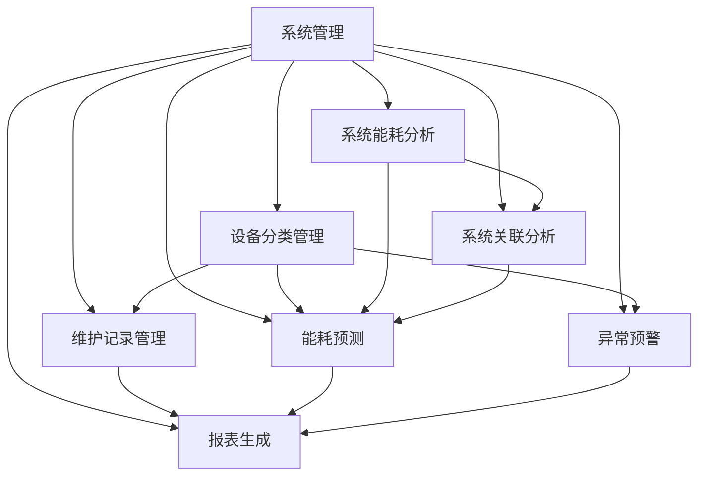
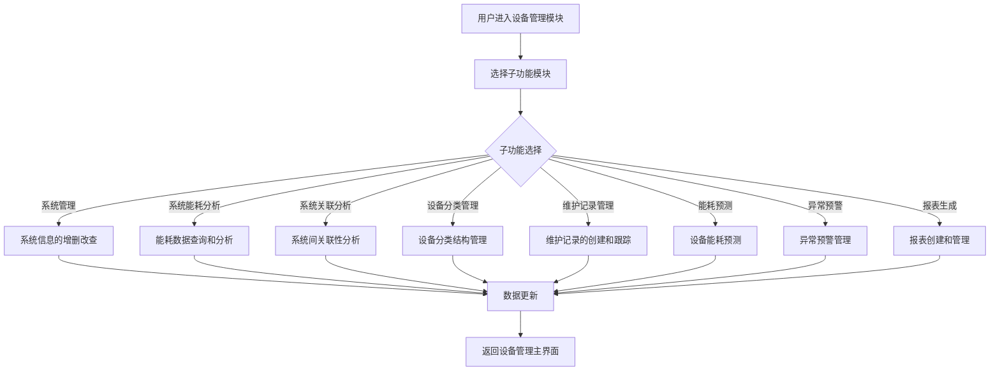

# 设备管理功能设计文档

UI设计地址：https://www.figma.com/design/k5TBKzoZJ0DPn5LobyEc20/%E9%AB%98%E9%93%81%E7%AB%99%E8%83%BD%E8%80%97%E6%BC%94%E7%A4%BA?node-id=24-7865&m=dev

## 1. 功能概述

设备管理功能是中国高铁站节能降耗演示系统的核心模块之一，提供了全方位的设备与系统管理能力，包括系统管理、能耗分析、关联分析、设备分类、维护记录、能耗预测、预警管理和报表生成等八个核心子功能。该模块实现了对高铁站各类设备系统的统一管理、监控和优化，支持设备全生命周期管理，通过数据分析和预测提升设备运行效率，降低能源消耗。

## 2. 功能结构

设备管理功能由以下八个核心子功能模块组成：

```
设备管理
├── 系统管理
├── 系统能耗分析
├── 系统关联分析
├── 设备分类管理
├── 维护记录管理
├── 能耗预测
├── 异常预警
└── 报表生成
```

## 3. 系统管理子功能

### 3.1 功能描述
系统管理子功能提供了对高铁站各类系统（如照明系统、空调系统、通风系统、给排水系统、电梯系统、安防系统等）进行增删改查的完整管理能力，支持系统分类、状态监控和基础信息维护。

### 3.2 功能清单

| 编号 | 功能名称 | 功能描述 |
|------|----------|----------|
| 3.2.1 | 系统列表展示 | 以表格形式展示所有系统信息，包括系统ID、名称、类型、设备数量、总功率、运行状态、描述和创建时间 |
| 3.2.2 | 系统信息筛选 | 支持按系统类型、运行状态进行筛选，快速定位目标系统 |
| 3.2.3 | 系统搜索 | 提供系统名称关键词搜索功能，快速查找特定系统 |
| 3.2.4 | 新增系统 | 提供新增系统的表单界面，包括系统名称、类型、功率、描述等字段 |
| 3.2.5 | 编辑系统 | 支持修改现有系统的基本信息，包括系统名称、类型、功率、描述等 |
| 3.2.6 | 删除系统 | 支持删除不需要的系统，提供二次确认防止误操作 |
| 3.2.7 | 导出系统信息 | 支持将系统信息导出为CSV格式，便于外部处理和分析 |

### 3.3 数据结构

系统信息表：

| 字段名 | 类型 | 说明 |
|--------|------|------|
| systemId | String | 系统ID，唯一标识符 |
| systemName | String | 系统名称 |
| systemType | String | 系统类型（如照明、空调、通风等） |
| deviceCount | Number | 关联设备数量 |
| totalPower | Number | 系统总功率(kW) |
| status | String | 运行状态（running/停机） |
| description | String | 系统描述信息 |
| createTime | Date | 创建时间 |

### 3.4 界面设计

系统管理界面采用经典的数据列表布局：
- 顶部工具栏：包含新增系统、导出功能按钮
- 筛选区：系统类型和运行状态筛选器
- 主体区：系统信息表格，支持排序、分页
- 系统类型标签：使用不同颜色标识不同系统类型
- 状态标签：使用不同颜色标识运行状态（绿色表示运行中，灰色表示停机）

## 4. 系统能耗分析子功能

### 4.1 功能描述
系统能耗分析子功能提供了针对不同系统（照明、空调、通风、给排水、电梯、安防等）的能耗数据进行多维度分析的能力，支持不同时间粒度的能耗统计、趋势分析和占比分析，并通过多种图表形式直观展示分析结果。

### 4.2 功能清单

| 编号 | 功能名称 | 功能描述 |
|------|----------|----------|
| 4.2.1 | 筛选条件设置 | 支持按系统、时间范围、统计粒度（日/周/月）设置筛选条件 |
| 4.2.2 | 能耗数据统计 | 统计总能耗、日均能耗、峰值能耗和平均负载率等关键指标 |
| 4.2.3 | 能耗趋势分析 | 提供折线图和柱状图两种展示方式，分析系统能耗随时间的变化趋势 |
| 4.2.4 | 系统能耗占比 | 提供饼图展示各系统能耗占总能耗的比例 |
| 4.2.5 | 能耗详情列表 | 展示能耗数据详情，支持按多列排序 |
| 4.2.6 | 导出报表 | 支持将分析结果导出为CSV格式 |
| 4.2.7 | 分页与翻页 | 支持对能耗数据列表进行分页显示 |

### 4.3 数据结构

能耗数据表：

| 字段名 | 类型 | 说明 |
|--------|------|------|
| id | String | 记录ID |
| date | Date | 日期 |
| systemName | String | 系统名称 |
| consumption | Number | 能耗(kWh) |
| peakPower | Number | 峰值功率(kW) |
| avgPower | Number | 平均功率(kW) |
| loadRate | Number | 负载率(%) |
| cost | Number | 预估费用(元) |

### 4.4 界面设计

系统能耗分析界面采用多区域布局：
- 顶部筛选区：系统选择、时间范围选择和统计粒度选择
- 统计卡片区：展示总能耗、日均能耗、峰值能耗和平均负载率四个关键指标
- 图表分析区：左侧趋势图（折线图或柱状图），右侧占比图（饼图）
- 底部数据表：展示详细的能耗数据列表，支持分页

## 5. 系统关联分析子功能

### 5.1 功能描述
系统关联分析子功能提供了分析不同系统之间能耗关联关系的能力，通过计算系统间的Pearson相关系数，识别系统间的能耗联动模式，发现异常关联行为，为系统优化调度提供数据支持。

### 5.2 功能清单

| 编号 | 功能名称 | 功能描述 |
|------|----------|----------|
| 5.2.1 | 分析参数设置 | 支持选择参与分析的系统、时间范围等参数 |
| 5.2.2 | 相关性热力图 | 提供多系统间相关性热力图，直观展示相关系数矩阵 |
| 5.2.3 | 能耗联动趋势 | 提供叠加和分离两种视图模式，分析多系统能耗联动趋势 |
| 5.2.4 | 关联强度分布 | 提供关联强度分布饼图，统计强相关、中等相关、弱相关和负相关数量 |
| 5.2.5 | 关键发现总结 | 自动分析关联数据，生成关键发现和建议 |
| 5.2.6 | 详细关联数据表 | 展示系统间详细关联数据，包括相关系数、关联强度、时间滞后和关联描述 |
| 5.2.7 | 导出分析数据 | 支持将分析结果导出为CSV格式 |
| 5.2.8 | 生成分析报告 | 支持生成系统关联分析报告 |

### 5.3 数据结构

系统关联数据表：

| 字段名 | 类型 | 说明 |
|--------|------|------|
| id | String | 关联记录ID |
| system1 | String | 系统1名称 |
| system2 | String | 系统2名称 |
| coefficient | Number | 相关系数（-1到1之间） |
| strength | String | 关联强度（强相关/中等相关/弱相关/几乎无关/负相关） |
| lag | Number | 时间滞后（小时） |
| description | String | 关联描述 |

### 5.4 界面设计

系统关联分析界面采用多区域布局：
- 顶部筛选区：系统多选、时间范围选择
- 分析结果区：包含相关性热力图、能耗联动趋势图、关联强度分布图和关键发现面板
- 底部数据表：展示详细的系统关联数据列表
- 空状态提示：当未设置分析参数时，展示空状态提示和功能说明

## 6. 设备分类管理子功能

### 6.1 功能描述
设备分类管理子功能提供了设备分类的层次化管理和维护能力，支持创建多级分类结构，配置分类颜色和图标，并可查看每个分类下的设备数量统计。分类结构采用树形组件展示，支持分类的展开、折叠和节点点击操作。

### 6.2 功能清单

| 编号 | 功能名称 | 功能描述 |
|------|----------|----------|
| 6.2.1 | 分类树展示 | 以树形结构展示设备分类，支持多级分类展示 |
| 6.2.2 | 分类展开/折叠 | 支持一键展开全部和折叠全部功能 |
| 6.2.3 | 分类节点操作 | 支持节点点击、新增子分类、编辑分类和删除分类 |
| 6.2.4 | 分类详情展示 | 点击分类节点，展示该分类的详细信息和设备列表 |
| 6.2.5 | 新增分类 | 支持创建新的设备分类，可设置分类名称、颜色、图标和父分类 |
| 6.2.6 | 编辑分类 | 支持修改分类名称、颜色、图标等属性 |
| 6.2.7 | 删除分类 | 支持删除不需要的分类，提供二次确认防止误操作 |
| 6.2.8 | 分类数据导出 | 支持将分类结构导出为JSON格式 |

### 6.3 数据结构

设备分类表：

| 字段名 | 类型 | 说明 |
|--------|------|------|
| id | String | 分类ID |
| name | String | 分类名称 |
| parentId | String | 父分类ID |
| color | String | 分类颜色（十六进制） |
| icon | String | 分类图标（FontAwesome类名） |
| deviceCount | Number | 设备数量 |
| description | String | 分类描述 |
| createTime | Date | 创建时间 |

### 6.4 界面设计

设备分类管理界面采用左右分栏布局：
- 左侧分类树区：以树形组件展示设备分类结构，支持节点点击、展开/折叠操作
- 右侧分类详情区：展示当前选中分类的详细信息和设备列表
- 工具栏：包含新增分类、展开全部、折叠全部和导出功能按钮
- 节点标签：在每个分类节点上显示设备数量标签和操作按钮

## 7. 维护记录管理子功能

### 7.1 功能描述
维护记录管理子功能提供了设备维护工作的记录、跟踪和管理能力，支持创建不同类型的维护记录（例行保养、故障维修、紧急抢修、预防性维护），提供批量排程功能，并支持维护记录的查询、筛选和导出。

### 7.2 功能清单

| 编号 | 功能名称 | 功能描述 |
|------|----------|----------|
| 7.2.1 | 维护记录列表 | 以表格形式展示所有维护记录，包括设备名称、维护类型、状态、执行人员、开始时间等 |
| 7.2.2 | 筛选条件设置 | 支持按状态（待处理/进行中/已完成/已取消）、类型（例行保养/故障维修/紧急抢修/预防性维护）进行筛选 |
| 7.2.3 | 维护记录搜索 | 提供设备名称和维护单号关键词搜索功能 |
| 7.2.4 | 新增维护记录 | 支持创建新的维护记录，包括设备选择、维护类型、描述、执行人员等信息 |
| 7.2.5 | 编辑维护记录 | 支持修改维护记录的各项信息 |
| 7.2.6 | 删除维护记录 | 支持删除不需要的维护记录，提供二次确认防止误操作 |
| 7.2.7 | 批量排程 | 支持对多个维护记录进行批量排程调度 |
| 7.2.8 | 导出维护记录 | 支持将维护记录导出为CSV格式 |
| 7.2.9 | 维护统计 | 统计总维护记录、待处理、进行中、已完成数量，并提供可视化图表 |

### 7.3 数据结构

维护记录表：

| 字段名 | 类型 | 说明 |
|--------|------|------|
| id | String | 维护记录ID |
| deviceName | String | 设备名称 |
| maintenanceType | String | 维护类型（例行保养/故障维修/紧急抢修/预防性维护） |
| status | String | 状态（待处理/进行中/已完成/已取消） |
| technician | String | 执行人员 |
| startTime | Date | 开始时间 |
| endTime | Date | 结束时间 |
| duration | Number | 维护耗时（小时） |
| cost | Number | 维护成本（元） |
| description | String | 维护描述 |
| attachments | Array | 附件列表 |
| createTime | Date | 创建时间 |

### 7.4 界面设计

维护记录管理界面采用多区域布局：
- 顶部工具栏：包含新增记录、批量排程、导出功能按钮和搜索框
- 筛选区：状态和类型筛选器
- 统计卡片区：展示总维护记录、待处理、进行中、已完成数量
- 主体区：维护记录表格，支持分页和排序
- 时间线视图（可选）：以时间线形式展示维护记录，直观显示维护计划与实际执行情况

## 8. 能耗预测子功能

### 8.1 功能描述
能耗预测子功能提供了使用多种机器学习模型（LSTM、Prophet、ARIMA、XGBoost）对设备能耗进行短期预测的能力，支持模型训练、预测参数配置、预测结果可视化和预测准确度评估，帮助预测未来能耗趋势，优化能源使用计划。

### 8.2 功能清单

| 编号 | 功能名称 | 功能描述 |
|------|----------|----------|
| 8.2.1 | 设备选择 | 支持选择要预测的设备 |
| 8.2.2 | 预测模型选择 | 支持选择预测模型（LSTM、Prophet、ARIMA、XGBoost） |
| 8.2.3 | 预测参数设置 | 支持设置预测时间范围、训练数据范围等参数 |
| 8.2.4 | 模型训练 | 支持使用历史数据训练选定的预测模型 |
| 8.2.5 | 预测结果展示 | 以图表形式展示预测结果，包括能耗趋势、预测准确度等 |
| 8.2.6 | 预测指标统计 | 统计预测能耗、预测准确度、预测趋势等指标 |
| 8.2.7 | 预测记录管理 | 支持保存和管理历史预测记录 |
| 8.2.8 | 导出预测报告 | 支持将预测结果导出为CSV或PDF格式 |

### 8.3 数据结构

能耗预测记录表：

| 字段名 | 类型 | 说明 |
|--------|------|------|
| id | String | 预测记录ID |
| deviceId | String | 设备ID |
| deviceName | String | 设备名称 |
| modelType | String | 预测模型类型（LSTM/Prophet/ARIMA/XGBoost） |
| trainingDataRange | String | 训练数据范围 |
| predictionRange | String | 预测时间范围 |
| predictedConsumption | Number | 预测总能耗(kWh) |
| accuracy | Number | 预测准确度(%) |
| trend | Number | 趋势百分比 |
| createTime | Date | 创建时间 |

### 8.4 界面设计

能耗预测界面采用多区域布局：
- 顶部工具栏：包含新建预测、训练模型、导出报告功能按钮
- 预测参数区：设备选择、模型选择等参数配置
- 统计指标区：展示预测能耗、准确度、趋势等关键指标
- 预测图表区：展示预测趋势图和模型评估图
- 预测记录区：展示历史预测记录列表

## 9. 异常预警子功能

### 9.1 功能描述
异常预警子功能提供了设备异常状态的实时监控和预警管理能力，支持不同预警级别（严重、警告、提示）的设置和管理，提供预警事件的处理状态跟踪，并支持预警数据的统计分析和报告导出。

### 9.2 功能清单

| 编号 | 功能名称 | 功能描述 |
|------|----------|----------|
| 9.2.1 | 预警事件列表 | 以表格形式展示所有预警事件，包括预警级别、设备、位置、状态、时间等 |
| 9.2.2 | 预警级别筛选 | 支持按预警级别（严重、警告、提示）进行筛选 |
| 9.2.3 | 预警状态筛选 | 支持按处理状态（未处理、处理中、已处理）进行筛选 |
| 9.2.4 | 预警搜索 | 提供设备名称和位置关键词搜索功能 |
| 9.2.5 | 预警级别设置 | 支持设置不同设备类型的预警级别和阈值 |
| 9.2.6 | 一键已读 | 支持将所有未读预警标记为已读 |
| 9.2.7 | 预警处理 | 支持对预警事件进行处理和状态更新 |
| 9.2.8 | 预警统计 | 统计严重预警、警告和提示数量，并提供趋势分析图表 |
| 9.2.9 | 导出预警报告 | 支持将预警数据导出为CSV或PDF格式 |

### 9.3 数据结构

预警事件表：

| 字段名 | 类型 | 说明 |
|--------|------|------|
| id | String | 预警事件ID |
| deviceId | String | 设备ID |
| deviceName | String | 设备名称 |
| location | String | 设备位置 |
| level | String | 预警级别（critical/warning/info） |
| title | String | 预警标题 |
| description | String | 预警描述 |
| value | Number | 预警值 |
| threshold | Number | 预警阈值 |
| status | String | 处理状态（pending/processing/processed） |
| acknowledged | Boolean | 是否已读 |
| createTime | Date | 创建时间 |
| processTime | Date | 处理时间 |

### 9.4 界面设计

异常预警界面采用多区域布局：
- 顶部工具栏：包含一键已读、导出报告、预警设置功能按钮
- 筛选区：预警级别和状态筛选器
- 统计卡片区：展示严重预警、警告和提示数量
- 预警列表区：展示预警事件列表，支持分页
- 预警分布图：展示预警时间分布和级别分布图表
- 预警详情区：展示当前选中预警的详细信息和处理历史

## 10. 报表生成子功能

### 10.1 功能描述
报表生成子功能提供了灵活的报表创建和管理能力，支持多种类型报表（能耗报表、设备运行报表、维护报表、预警报表、综合报表）的生成，支持自定义报表模板，并提供了报表预览、下载和管理功能。

### 10.2 功能清单

| 编号 | 功能名称 | 功能描述 |
|------|----------|----------|
| 10.2.1 | 报表类型选择 | 支持选择不同类型的报表（能耗、设备运行、维护、预警、综合） |
| 10.2.2 | 时间范围设置 | 支持设置报表数据的时间范围 |
| 10.2.3 | 新建报表 | 支持创建自定义报表，配置报表类型、数据范围、设备、输出格式等 |
| 10.2.4 | 报表模板管理 | 支持创建、编辑和删除报表模板 |
| 10.2.5 | 报表预览 | 支持在线预览生成的报表内容 |
| 10.2.6 | 报表下载 | 支持下载已生成的报表，支持PDF、Excel、Word、HTML等格式 |
| 10.2.7 | 报表管理 | 支持查看、删除已生成的报表 |
| 10.2.8 | 自动生成 | 支持设置定时自动生成报表任务 |
| 10.2.9 | 报表统计 | 统计报表总数、本月生成、下载次数和定时任务数量 |

### 10.3 数据结构

报表记录表：

| 字段名 | 类型 | 说明 |
|--------|------|------|
| id | String | 报表ID |
| name | String | 报表名称 |
| type | String | 报表类型（energy/operation/maintenance/warning/comprehensive） |
| startDate | Date | 开始日期 |
| endDate | Date | 结束日期 |
| devices | Array | 设备ID列表 |
| formats | Array | 输出格式列表 |
| template | String | 报表模板 |
| status | String | 生成状态（completed/pending/failed） |
| size | Number | 文件大小（字节） |
| createTime | Date | 生成时间 |
| summary | Object | 报表摘要数据 |

### 10.4 界面设计

报表生成界面采用多区域布局：
- 顶部工具栏：包含新建报表、自动生成、模板管理功能按钮
- 报表参数区：报表类型选择和时间范围设置
- 统计卡片区：展示报表总数、本月生成、下载次数和定时任务数量
- 报表列表区：展示已生成报表列表，支持分页
- 报表类型分布图：展示不同类型报表的比例分布
- 常用模板区：展示常用报表模板，支持直接使用模板生成报表

## 11. 数据流向图

设备管理模块的数据流向图如下：



## 12. 业务流程图

设备管理模块的核心业务流程如下：



## 13. 异常处理机制

设备管理模块的异常处理机制包括以下几个方面：

1. **数据验证异常**：对用户输入的数据进行严格验证，确保数据格式和值域的正确性
2. **网络请求异常**：对API请求失败进行捕获，提供重试机制和友好的错误提示
3. **图表渲染异常**：对ECharts图表渲染失败进行捕获，提供降级展示方案
4. **权限控制异常**：对无权限操作进行拦截，提供相应的提示信息
5. **数据加载异常**：对数据加载失败提供重试按钮和错误详情展示
6. **资源不足异常**：对系统资源不足情况提供提示和优化建议

## 14. 性能要求

设备管理模块的性能要求如下：

1. **响应时间**：页面初始加载时间不超过2秒，数据查询响应时间不超过1秒
2. **并发处理**：支持至少100个并发用户同时访问
3. **数据处理**：支持处理至少10000条记录的数据表格展示
4. **图表渲染**：支持渲染复杂图表，包含至少6个数据系列
5. **内存使用**：单页面内存占用不超过500MB
6. **缓存策略**：对频繁访问的数据进行缓存，提高访问速度

## 15. 安全要求

设备管理模块的安全要求如下：

1. **访问控制**：所有功能需要用户登录后才能访问
2. **权限管理**：不同角色用户具有不同的功能访问权限
3. **数据校验**：对所有输入数据进行严格校验，防止SQL注入和XSS攻击
4. **操作日志**：记录所有关键操作的日志，便于审计和追踪
5. **敏感信息保护**：对敏感数据进行加密存储和传输
6. **会话管理**：提供安全的会话管理机制，防止会话劫持

## 16. 技术实现方案

设备管理模块的技术实现方案如下：

1. **前端框架**：Vue 3 + Element UI
2. **图表库**：ECharts 5
3. **图标库**：FontAwesome
4. **状态管理**：Vuex
5. **数据处理**：Mock.js模拟数据
6. **路由管理**：Vue Router
7. **代码规范**：ESLint + Prettier

## 17. 接口定义

设备管理模块的主要接口定义如下：

1. **系统管理接口**
   - GET /api/systems - 获取系统列表
   - POST /api/systems - 创建系统
   - PUT /api/systems/:id - 更新系统信息
   - DELETE /api/systems/:id - 删除系统

2. **系统能耗分析接口**
   - GET /api/systems/energy - 获取系统能耗数据
   - GET /api/systems/energy/stats - 获取能耗统计数据

3. **系统关联分析接口**
   - GET /api/systems/correlation - 获取系统关联数据
   - POST /api/systems/correlation/analyze - 执行关联分析

4. **设备分类管理接口**
   - GET /api/device/categories - 获取设备分类树
   - POST /api/device/categories - 创建设备分类
   - PUT /api/device/categories/:id - 更新设备分类
   - DELETE /api/device/categories/:id - 删除设备分类

5. **维护记录管理接口**
   - GET /api/maintenance/records - 获取维护记录列表
   - POST /api/maintenance/records - 创建维护记录
   - PUT /api/maintenance/records/:id - 更新维护记录
   - DELETE /api/maintenance/records/:id - 删除维护记录

6. **能耗预测接口**
   - GET /api/energy/forecast - 获取预测记录
   - POST /api/energy/forecast - 创建预测
   - POST /api/energy/forecast/:id/train - 训练预测模型

7. **异常预警接口**
   - GET /api/warnings - 获取预警列表
   - PUT /api/warnings/:id - 更新预警状态
   - GET /api/warnings/stats - 获取预警统计

8. **报表生成接口**
   - GET /api/reports - 获取报表列表
   - POST /api/reports - 创建报表
   - GET /api/reports/:id - 获取报表详情
   - DELETE /api/reports/:id - 删除报表

## 18. 开发计划

设备管理模块的开发计划如下：

| 阶段 | 任务 | 时间 | 负责人 |
|------|------|------|--------|
| 需求分析 | 需求确认、接口定义 | 1天 | 产品经理 |
| 系统设计 | 数据库设计、界面设计 | 2天 | 架构师 |
| 编码开发 | 前端页面开发、接口对接 | 5天 | 前端工程师 |
| 测试验证 | 功能测试、性能测试 | 2天 | 测试工程师 |
| 优化完善 | 问题修复、性能优化 | 1天 | 前端工程师 |

## 19. 测试计划

设备管理模块的测试计划如下：

1. **功能测试**
   - 系统管理功能测试
   - 系统能耗分析功能测试
   - 系统关联分析功能测试
   - 设备分类管理功能测试
   - 维护记录管理功能测试
   - 能耗预测功能测试
   - 异常预警功能测试
   - 报表生成功能测试

2. **性能测试**
   - 页面加载时间测试
   - 数据查询响应时间测试
   - 图表渲染性能测试
   - 大数据量处理测试
   - 并发访问测试

3. **兼容性测试**
   - 不同浏览器兼容性测试
   - 不同屏幕尺寸响应式测试
   - 不同操作系统兼容性测试

4. **安全性测试**
   - 权限控制测试
   - 数据校验测试
   - 敏感信息保护测试

## 20. 总结

设备管理功能作为中国高铁站节能降耗演示系统的核心模块之一，提供了全方位的设备与系统管理能力。通过系统管理、能耗分析、关联分析、设备分类、维护记录、能耗预测、预警管理和报表生成等八个核心子功能，实现了对高铁站各类设备系统的统一管理、监控和优化。该模块采用Vue 3 + Element UI技术栈开发，提供了直观友好的操作界面和丰富的数据可视化能力，能够有效支持高铁站设备管理的各项需求。